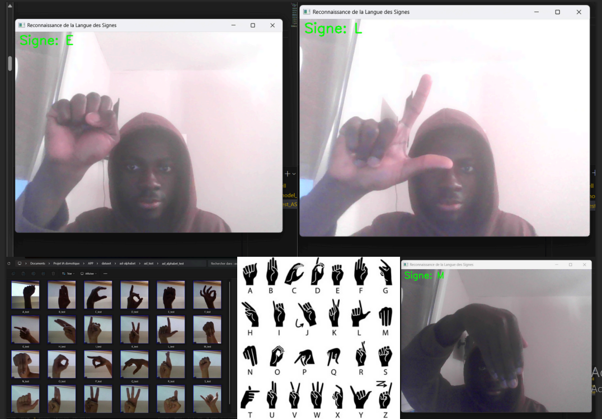

# ASL Sign Language CNN Classifier



A TensorFlow/Keras convolutional neural network (CNN) project for classifying **static American Sign Language (ASL) alphabet hand signs** from images.

The project includes a portable training pipeline based on image augmentation, an automatic validation split, CNN-based classification and model export. The dataset is deliberately not included in this repository: it must be downloaded separately and kept local.

> **Project scope:** static alphabet-sign classification from individual images.  
> This project does not translate complete ASL conversations, continuous signing, grammar, facial expressions or signs that require motion over time.

---

## Demonstration

The screenshot below shows the real-time recognition interface developed during the project. It displays webcam-based predictions for several static signs, including `E`, `L` and `M`.


---

## Features

- Image classification of static ASL alphabet signs.
- TensorFlow/Keras CNN training workflow.
- Input image resizing to `64 × 64` pixels.
- Image normalization with pixel values scaled to `[0, 1]`.
- Data augmentation for improved training robustness:
  - Random shear.
  - Random zoom.
  - Horizontal flip.
- Training/validation split generated automatically from the training set.
- CNN architecture with three convolution and max-pooling blocks.
- Dense classification head with batch normalization and dropout.
- Automatic class-count detection from dataset folders.
- Model export in the `.keras` format.
- Training and validation curve export.

---

## Project structure

```text
.
├── assets/
│   └── images/
│       └── asl_realtime_sign_recognition_demo.png
│
├── src/
│   └── train.py
│
├── .gitignore
├── requirements.txt
└── README.md
```

The following directories are created automatically or are expected locally after downloading a dataset. They are ignored by Git:

```text
data/
models/
results/
```

---

## Dataset

The dataset is not included because image datasets can be large and may have redistribution restrictions. Download a compatible ASL alphabet image dataset from a public dataset platform, then review its license and terms before use.

Recommended places to search:

- [Kaggle](https://www.kaggle.com/datasets): search for `ASL Alphabet` or `American Sign Language Alphabet`.
- [Google Dataset Search](https://datasetsearch.research.google.com/): search for `American Sign Language alphabet dataset`.
- [Roboflow Universe](https://universe.roboflow.com/): search for ASL hand-sign image datasets.
- [Hugging Face Datasets](https://huggingface.co/datasets): search for ASL or sign-language datasets.
- [Papers with Code Datasets](https://paperswithcode.com/datasets): search for sign-language computer-vision datasets.

> Google Scholar is useful for finding research papers that describe datasets, but Kaggle and Google Dataset Search are generally more practical for finding downloadable image datasets.

### Expected folder structure

The training script expects the following local structure:

```text
data/
├── asl_alphabet_train/
│   ├── A/
│   ├── B/
│   ├── C/
│   ├── ...
│   ├── del/
│   ├── nothing/
│   └── space/
│
└── asl_alphabet_test/
    ├── A/
    ├── B/
    ├── C/
    └── ...
```

Each class must be stored in its own folder. For example:

```text
data/asl_alphabet_train/A/
data/asl_alphabet_train/B/
data/asl_alphabet_train/C/
```

Do not rename the class folders unless you also intend to change the associated labels. TensorFlow reads folder names as class labels.

If the downloaded dataset uses different directory names, update the path variables in `src/train.py`:

```python
TRAIN_DIR = PROJECT_ROOT / "data" / "asl_alphabet_train"
TEST_DIR = PROJECT_ROOT / "data" / "asl_alphabet_test"
```

---

## Installation

Clone the repository:

```bash
git clone [https://github.com/Josephulrich/asl-sign-language-cnn-classifier.git](https://github.com/Josephulrich/asl-sign-language-cnn-classifier.git)
cd asl-sign-language-cnn-classifier
```

Create and activate a virtual environment:

```bash
python -m venv .venv
```

On Windows:

```bash
.venv\Scripts\activate
```

Install the dependencies:

```bash
pip install -r requirements.txt
```

---

## Training

1. Download an ASL alphabet dataset.
2. Extract it into the `data/` folder following the expected directory structure.
3. Run:

```bash
python src/train.py
```

During training, the script:

- Loads training images from `data/asl_alphabet_train/`.
- Resizes images to `64 × 64`.
- Rescales RGB pixels to the `[0, 1]`
